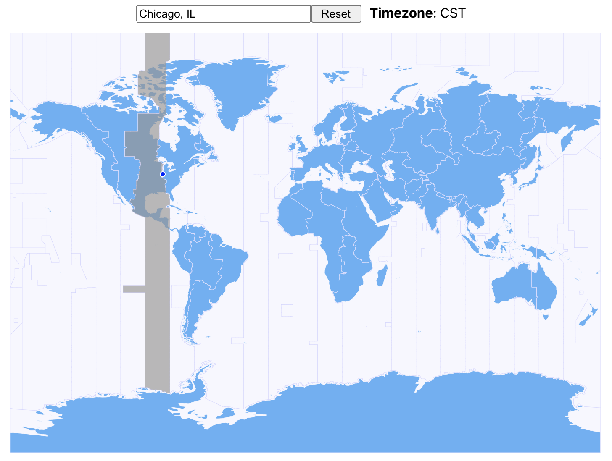
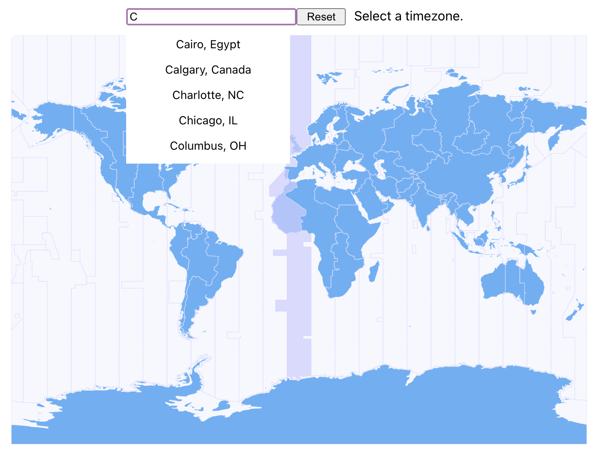

## ZonePicker

ZonePicker is a sleek, lightweight, and customizable plugin for selecting and getting the timezone of different regions across a world map. It includes a city finding feature that identifies the nearest urban area at any location and a dropdown to facilitate city selection.  
## Motivation

Abbreviations of timezone names are often ambigious-- for example, CST can represent Central Standard Time (GMT-6:00), Cuba Standard Time (GMT-5:00), or China Standard Time (GMT+8:00)--and the nomenclature in terms of GMT offset is difficult to remember. 
Timezone selection is signficiantly faster and more accurate with geographical context in the form of a world map than with a form or input bar alone. 
## Build Status

## Screenshots 

 

## Features

## Installation

## License
